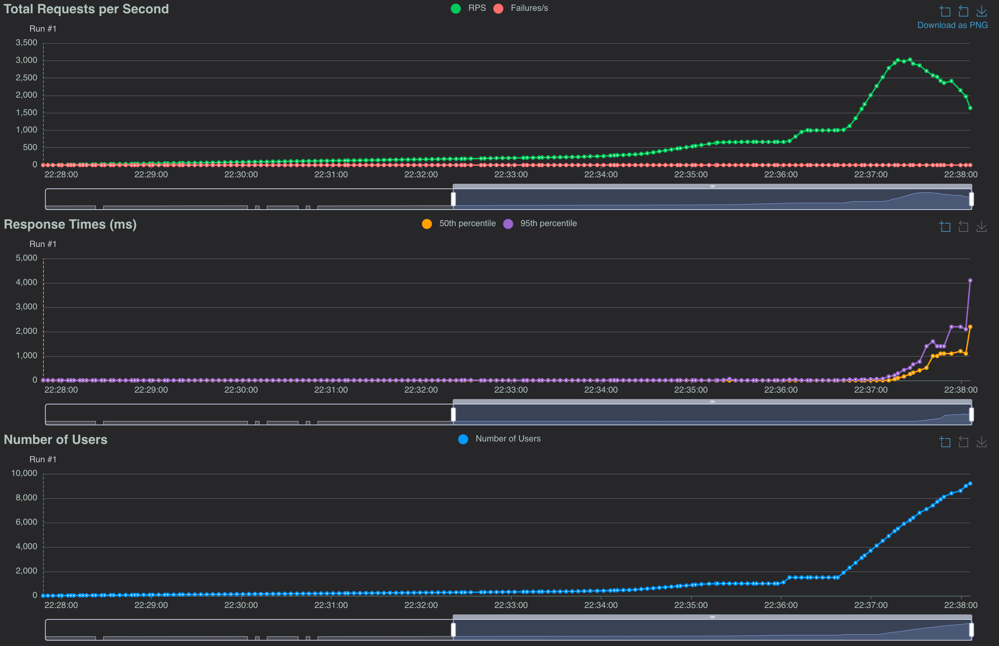

## Run and Test the application

### Prerequisites
[locust](https://locust.io) (load testing tool)

you can install locust via brew: `brew install locust`
or via pip: `pip3 install locust`

### Building the executables locally
use `make build` to build the executables for the server and client simulations to the tmp/ directory.

### Running the server

Use `make run-server` to start the server. You can configure the amount of workers and the queue size in the config.yaml

### Running the client simulation

Use `make run-clients` to start the client simulation. You can also adjust the amount of client simulations running in parallel.
Each Client will create 3 jobs and wait on completion of those by polling the status every second. 
Once all are complete, it starts over.

## Load test results

The load test was done with a ramp up of users. Slow rampup to 500 concurrent clients with a spawnrate of 1 client per second.
After that, spawn rate was grdually increased to 100 new clients per second with a set maximum of 15000 Clients allowed.
Hardware limit was reached at ~8000 concurrent clients.

Maximum requests per second peaked at 3k rps before my local cpu couldnt handle it anymore. This equates to ~180k rpm

Response times where stable at 5-10 ms under load with a 95th percentile of 60-70 ms. 
With overload request times drove to over 100ms.

## Assumptions and Risks
### Assumptions
- Job queue is Ephemeral
- Worker errors dont need to be reported back to clients
- Completed jobs still need to be stored

### Risks and other Notes
Possible unhandled memory consumption/leak with high amount of stored job statuses if we don’t want to delete them immediately.

Redis/Valkey or kafka pub sub would be a consideration to replace such a map/queue or deleting jobs after a cetain time after completion

When a new deployment is deployed or when the server shuts down in general the jobs in the queue are lost.

Usage of correct headers for ratelimiting should be added to have correct backoff mechanisms on the client side.

When a worker process crashes it does not get replaced.

Could work with head requests and status codes to save cpu time spent on json

When the server shuts down there is no way of seeing when or if the recent jobs have been completed since the http server closes to interrupt the flow of create job requests.